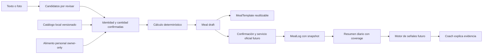

# Nutrition Intelligence 2.0 — diseño y arquitectura propuesta

Estado: dirección arquitectónica y visual aprobada por el usuario; ajustes de cierre
UI/UX verificados, 8 de octubre de 2026. Base auditada: `master`
`73bbc2f6660c750853f4cd1987d4ab8609832b28`, igual a `origin/master` local al iniciar.
Rama: `design/nutrition-intelligence-2`, checkout actual, sin worktree.
No se verificó el servidor remoto ni se accedió al NAS.

Esta entrega contiene auditoría de código, contratos conceptuales, evaluación de
fuentes y un prototipo estático con fixtures ficticias QA. No redefine los JSON
Schemas públicos existentes ni activa funcionalidades de producción. Backend,
migraciones, sincronización, reconocimiento AI real y señales nuevas: fuera de alcance.

## Auditoría del estado actual

Se inspeccionó código y pruebas; no se leyeron datos personales, `.env`, `/data`
ni volúmenes persistentes. Los nombres y cantidades del prototipo son ficticios.

| Área | Evidencia en código | Comportamiento y límite observado |
| --- | --- | --- |
| Día | `backend/app/models/nutrition.py::DailyNutrition` | Único por usuario/fecha. Valores opcionales `Numeric(12,3)` para calorías, proteína, grasa, carbohidratos netos/totales, fibra, azúcar y sodio. Fuente, archivo, notas y payload original. No hay micronutrientes genéricos. |
| Comida consumida | `NutritionMeal` en el mismo archivo | Agrupa items por tipo, nombre y orden. No es receta reutilizable ni un evento consumido con hora propia. Mobile agrupa por tipo dentro del día. |
| Entrada | `NutritionItem` | Nombre, cantidad y unidad opcionales; valores consumidos almacenados; referencias opcionales a producto y receta; UUID público, revisión, origen e idempotencia por usuario/evento. No almacena el desglose íntegro de ingredientes consumidos de una receta. |
| Alimento reutilizable | `FoodProduct` en `models/nutrition.py` | Es personal, no catálogo externo global. Nombre, marca, porción en g/etiqueta, siete métricas por 100 g, fuente, revisión y payload. Ya soporta fibra y sodio. No tiene barcode ni múltiples porciones estructuradas. |
| Receta | `backend/app/models/recipe.py` | `Recipe` tiene porciones, rendimiento en g opcional e ingredientes. `RecipeIngredient` conserva nombre/marca y valores por 100 g copiados del producto, con cantidad en g. Total/per_serving/per_100g con Decimal. Un ingrediente sin una métrica vuelve desconocido el total de receta de esa métrica. |
| Servicios de receta | `backend/app/services/recipes.py` | Creación, edición y duplicado owner-only; copia de valores del producto al ingrediente. Base útil para MealTemplate, pero sin revisión explícita del template ni snapshots históricos de todo el desglose en NutritionItem. |
| Web | `wellness/routes.py::manual_nutrition`, `foods/routes.py`, `recipes/routes.py` | Formularios de nutrición, alacena y recetas, selección de producto/receta y previsualización de macros. Manual genera JSON estándar, valida e importa. No hay flujo foto → candidatos. |
| Import | `services/importers/daily_nutrition.py`, `food_product.py`, `recipe.py`, `recipe_bundle.py` | Imports de nutrición, productos y recetas. Daily valida schema, usuario/archivo, orden y recetas; rechaza una segunda fecha ya registrada. Totales por métrica: suma items conocidos o usa total explícito si no hay items conocidos. No es un motor de cobertura por ingrediente. |
| Contrato público | `schemas/daily_nutrition.schema.json`, `food_product.schema.json`, `recipe.schema.json` | Contratos 1.0 existentes. Daily usa `calories_kcal`, `total_carbs_g` y `net_carbs_g`; `carbohydrate_g` también está permitido en el nivel diario vigente. No se cambia ni se generaliza esta excepción. Producto/receta tienen envelopes propios con `type`. |
| Dashboard | `services/dashboard/nutrition.py::NutritionTrendService` | Lee DailyNutrition filtrado por usuario/rango. Calorías/balance/proteína, promedios, objetivos y cobertura por días conocidos. El objetivo de carbohidratos de esta vista se compara con netos. No confundir esa semántica con carbohidratos totales. |
| AI reads | `services/ai/capabilities/domains/nutrition.py`, `services/ai/tools.py`, `services/nutrition_patterns.py` | `get_nutrition_summary`, `get_food_patterns`, fuentes, tendencias y comparación con metas. Declara unknown_not_zero y separa carbohidratos netos/totales. Los patrones son una pieza reutilizable para frecuentes. |
| Operator | `services/ai/capabilities/domains/nutrition_actions.py` | `nutrition.food.create`: draft de una o más entradas, preview/confirmación y apply por `create_nutrition_item`. Campos opcionales de macros/sodio; no identificación canónica ni micronutrientes. Conservar la capacidad y añadir un camino separado validado después. |
| Coach | `services/coach.py` | Ya calcula señales de proteína bajo objetivo y cobertura temporal. La comparación semanal requiere días registrados y días con meta (mínimo 5 en ese caso). No evalúa cobertura micronutricional por ingrediente. |
| Metas | `models/engagement.py`, `services/dashboard/goals.py` | Metas nutricionales de calorías, proteína, carbohidratos y grasa; historial/efectividad por fecha. No hay objetivo genérico de micronutrientes ni reference engine. |
| API y serializers | `api_v1/mobile_health_routes.py`, `services/mobile_health.py` | Lectura del día; create/patch/duplicate/delete de entradas; catálogo de alimentos personal y alta/edición. Allowlist, ownership por usuario efectivo, revisión/idempotencia; serializer usa UUID y `data_complete` de macros, no coverage genérico. |
| Android | `android/app/src/main/java/io/healthtracker/companion/ui/HealthScreens.kt` | NutritionDayScreen permite cantidad/unidad, alimentos cacheados, cálculo por g, captura manual, edición/repetición y estado de sincronización. HealthScreens muestra datos incompletos; UI de catálogo offline existente. No es catálogo externo ni reconocimiento visual. |
| Exportación | `services/exporters/wellness.py`, `recipe.py`, `user_data.py` | Exportan snapshots de valores de día/items, productos y recetas. El builder wellness actual no emite `food_product_id`/`recipe_id` aunque el schema los permite: no prometer round-trip íntegro de identidad consumida. |
| Portabilidad/backup | `services/portability_export.py`, `backups.py` | Secciones `nutrition_entries`/`custom_foods`, UUID/revisión y vínculo público al producto en portabilidad; full-user export incluye recetas y nutrición; restore remapea dominios. El contrato nuevo requerirá secciones versionadas para snapshots completos; no modificar ZIP hoy. |
| Pruebas existentes | `backend/tests/test_daily_nutrition.py`, `test_food_catalog_*`, `test_recipe_*`, `test_mobile_health.py`, `test_wellness_exports.py` | Codifican integración, schemas y ownership. Fueron leídas como evidencia; esta entrega no declara haber ejecutado la suite de backend. |

### Hallazgos que condicionan el diseño

- **Sí existen** alimento personal, ingredientes de receta, recetas reutilizables,
  porción simple, cantidades, unidades, valores consumidos históricos y procedencia básica.
- **Faltan** catálogo canónico externo, múltiples servings versionadas, nutrientes
  extensibles, provenance de cada valor/revisión, coverage por nutriente y snapshot
  completo del desglose consumido. Snapshot de macros no equivale a snapshot de receta.
- Recipe suma con política estricta de desconocido; DailyNutrition/mobile suma valores
  disponibles. Preservar esos comportamientos públicos y añadir metadatos de parcialidad;
  no sustituirlos silenciosamente con una nueva fórmula.
- Mobile `_ensure_meal` selecciona por tipo. Un nuevo MealLog con hora/identidad
  de evento no puede inferirse de ese agrupamiento sin información adicional.
- El importer diario copia `food_product_id` sin el chequeo explícito de ownership
  de producto que sí se observa para `recipe_id` en ese servicio. Se documenta para
  revisión posterior; no se cambia el backend en esta fase. El nuevo diseño exige
  resolución owner-only de ambos tipos de referencia antes de cualquier escritura.
- La selección `carbohydrate_g` móvil puede priorizar totales y caer a netos; el
  Dashboard actual compara netos. La adaptación futura debe llevar tipo/base,
  conservar las lecturas viejas y evitar comparaciones entre bases distintas.

## Arquitectura conceptual y responsabilidades

IA sólo propone identidad, cantidad y evidencia. Nunca es la fuente del vector
nutricional. Preview, búsqueda, detección y normalización son read-only.
Futura escritura: JSON estándar versionado → validación → confirmación ligada
al usuario/revisión → importador/servicio oficial → transacción MariaDB.
La UI no crea ORM ni admite `user_id` seleccionable. Flask/Jinja y Android
permanecen como clientes; este sandbox HTML/JS no introduce un framework productivo.

### Entidades propuestas y adaptación

| Concepto | Contrato conceptual | Adaptación al sistema actual |
| --- | --- | --- |
| Food | Identidad nutricional: ID interno estable, scope `catalog` o `user`, nombre, marca/GTIN opcionales, estado/preparación, base `100 g` o `100 ml`, revisiones inmutables | Mantener FoodProduct como alimento personal; añadir catálogo neutral separado después de aprobación. No convertir productos personales en globales. |
| Ingredient | Uso de Food: referencia a revisión, cantidad original, unidad/serving, cantidad normalizada y estado de resolución | Extender la idea de RecipeIngredient; admitir también un item legacy con valores declarados sin identidad inferida. |
| Meal | Agregado de ingredientes en edición, nombre y momento del día; no necesariamente persistido | Draft/preview. No reutilizar NutritionMeal como template por compartir nombre. |
| MealTemplate | Receta reutilizable owner-only con revisión y lista ordenada de ingredientes | Evolución de Recipe, conservando rendimiento/porciones y snapshot de valores; requiere plan de revisión/public IDs posterior. |
| MealLog | Evento consumido owner-only con UUID, fecha/hora/zone, tipo, revisión y snapshot completo | Se relacionaría con el día/agrupación NutritionMeal y entradas legacy, con trazabilidad exclusiva que evite duplicarlos. |
| Nutrient | Registro estable de ID, etiqueta, grupo, unidad, dimensión química/base y precisión de presentación | Nuevo registro genérico, sin columna por micronutriente. |
| FoodNutrient | Valor por revisión Food + Nutrient + base; estado y método, unidad, provenance | Preferencia: filas normalizadas para consulta/índices, Decimal. Snapshot del log en documento versionado validado. |
| Serving | Porción específica del Food/revisión; etiqueta, unidad, factor a g o ml y provenance | Evolución de serving_size_g/serving_label hacia varias definiciones, sin inferir equivalencias globales. |
| NutrientReference | Referencia seleccionable por nutriente/tipo/valor/unidad, fuente/revisión y restricciones opcionales | Independiente de UserGoal. No elegir valores normativos ni fuente de referencias hoy. |

**Persistencia evaluada, sin DDL:** filas FoodNutrient normalizadas facilitan
consulta y extensibilidad; JSON exclusivo de nutrientes facilita import pero
complica validación/indexado; columnas fijas multiplican migraciones. Se propone
relacional para catálogo y documentos inmutables versionados para snapshots.
Un registro Nutrient mantiene unidades/base semántica; el snapshot incluye los
valores y etiquetas usados sin requerir que siga existiendo una fuente externa.
Antes de implementar: revisar heads, compatibilidad MariaDB/SQLite, costes reales
del dataset escogido y propiedad de cada tabla. No se genera migración ahora.
La inspección estática de revision/down_revision en los archivos Alembic actuales
identifica un head `20260928_0043`; no se conectó a DB ni se ejecutó `flask db check`.

## Contratos propuestos: borrador, no API ni schema vigente

Los nombres siguientes son internos conceptuales. Toda nueva exportación pública
deberá tener JSON Schema aprobado con individual/batch de forma coherente.
No añadir campos a los schemas 1.0 para satisfacer este prototipo.

| Campo visible / concepto | Campo propuesto | Tipo/unidad/rango | Obligación y actualización |
| --- | --- | --- | --- |
| Identidad | `food_ref` + `food_revision` | Ref discriminada catálogo/personal, revisión no vacía | Requerido para cálculo de catálogo. Cambio crea nueva revisión, nunca merge por nombre. |
| Cantidad | `amount`, `unit`, `serving_ref` opcional | Decimal finito >0, g/ml o porción definida | Requerido en Ingredient resuelto; editable en draft. Legacy conserva ausencias/ceros vigentes sin fabricar detalle. |
| Normalización | `normalized_amount`, `normalized_unit`, `conversion_revision` | Decimal >0; g o ml | Calculado por servidor, no autoridad del cliente. Desconocido bloquea cálculo/confirmación del camino canónico. |
| Nutriente | `nutrient_id`, `value`, `value_state`, `unit`, `basis` | Decimal >=0 o null; known/unknown/trace/below_limit; base compatible | Known exige valor (incluye cero). Unknown no admite valor numérico. Trace/límite conserva calificador; no inventa cero ni promedio. |
| Fuente | `source`, `source_food_id`, `source_revision`, `source_name`, `nutrient_revision`, `verified_at` | Strings; timestamp nullable | IDs y revisión necesarios para catálogo importado; verified_at null si no verificado, no sustituir por fecha de sync. |
| Cobertura | `coverage`, `coverage_method`, `known_weight`, `total_weight`, `known_items`, `total_items` | Decimal [0,100] o null; denominador explícito | Sólo derivada por servidor. No editable, no merge; recalcular de snapshot. |
| Evento | `consumed_at`, `local_date`, `timezone`, `client_event_id`, `base_revision` | Hora zonificada opcional si legacy, fecha y revisión | Confirmación idempotente owner-bound; conflictos exigen revisión. No inventar hora en historia. |
| Referencia | `nutrient`, `reference_type`, `value`, `unit`, `constraints`, `source`, `revision` | Decimal >0, target/adequate_intake/upper_limit/etc.; sexo/edad opcionales | Sólo referencia aplicable elegida explícitamente; no usar límite superior como mínimo. |

Aliases de fuentes quedan en adaptadores/normalizadores; no en el contrato público.
`energy` conceptual se proyecta a `calories_kcal` legacy; protein a `protein_g`;
carbohydrate total a `total_carbs_g`, nunca a netos por omisión. Source user puede
tener nutrientes opcionales y sólo serving conocido. Modelo personal permite marca,
producto y barcode futuro, separado del catálogo, sin deduplicación agresiva.
Snapshot usa reemplazo confirmado y una nueva revisión; ausente en patch no toca,
null sólo limpia si política versionada lo admite. Sync de catálogo no hace merge
en registros consumidos. Duplicados de evento se detectan por usuario/client_event_id;
fuente externa por namespace/source_food_id/revisión, no por similitud de texto.

### Nutrientes y unidades

Macros iniciales: energy (kcal, kJ de origen conservado), protein, carbohydrate
**total**, fat y fiber (g). Conservar net_carbs y sugar legacy como nutrientes
distintos; no deducir netos de totales si no existe definición compatible.

| Grupo | IDs iniciales | Unidad base propuesta |
| --- | --- | --- |
| Minerales | sodium, potassium, calcium, iron, magnesium, phosphorus, zinc | mg |
| Vitaminas | vitamin_a (RAE), vitamin_d, vitamin_k, folate (DFE), vitamin_b12 | µg, con definición química/equivalente explícita |
| Vitaminas | vitamin_c, vitamin_e, thiamin, riboflavin, niacin, vitamin_b6 | mg; forma/equivalente conservados |
| Otros | choline | mg |

No sumar retinol y vitamina A RAE como si fueran la misma medida ni folato
alimentario y DFE sin un mapping y método verificados. Vitamina K1/K2 pueden
requerir IDs distintos. IU no se convierte con factor universal. Un adaptador
conserva source nutrient ID, unidad original, valor original, método y qualifiers.
`g ↔ mg ↔ µg` sólo dentro del mismo nutriente/forma; `kcal ↔ kJ` con factor
documentado; `ml ↔ g` sólo con densidad válida para ese alimento/estado/revisión.

Cálculo: `aporte = valor_base × cantidad_normalizada / cantidad_base` usando
Decimal, sin redondear cada ingrediente. La energía procede de la fuente; no
reconstruirla desde macros como sustituto silencioso. Cocción crudo/cocido son
identidades diferentes. Rendimiento de receta no prueba conservación de vitaminas:
retención o pérdida exige método/factor explícito; no simularlos como verificados.

Precisión propuesta: catálogo mantiene la precisión original y Decimal suficiente
para scaling; decidir Numeric exacto tras evaluar límites. DB actual usa 3 decimales.
UI: kcal enteras; g/macros hasta 1 decimal; mg normalmente hasta 1 decimal y µg
hasta 1 decimal si relevante, cero decimales cuando no aporta precisión. Valores
positivos por debajo de la resolución se muestran `<0.1`, no `0`. El prototipo
usa números pequeños QA y redondeo de presentación, no define el motor final.

## Provenance y honestidad

Food revision conserva source/source_food_id/source_revision/source_name y la
revisión nutricional. FoodNutrient conserva método (analizado, etiqueta, derivado,
declarado por usuario), fecha de fuente y calificador; `verified_at` significa
verificación real, no simple importación. Fuente desconocida legacy se etiqueta
como legacy/declarada, sin atribuirla a USDA ni a otra fuente.

- Un `0` explícito informado es conocido y participa en coverage.
- Campo ausente/null es desconocido; no se transforma en cero.
- Trace o `<límite` no se convierten a punto exacto sin política aprobada.
- Un valor calculable no demuestra cantidad exacta: mantener incertidumbre de
  identidad y cantidad por separado de disponibilidad del dato nutricional.
- Foto/texto retienen su tipo de captura; eso no cambia la fuente de nutrientes.
  No almacenar imágenes/evidencia sensible en logs de aplicación ni mandarlas a
  terceros en esta fase. Implementación futura deberá definir retención, borrado,
  límites de archivo y permisos con alcance owner-only antes de habilitar uploads.

## Coverage: definición que evita falsos déficits

Coverage expresa **disponibilidad de datos del registro**, no cumplimiento de
objetivo, confianza visual ni completitud del día real.

Para masa completamente normalizada:

`coverage_n = 100 × masa de ingredientes con valor utilizable n / masa total registrada`.

Método `mass_weighted_v1` con known_weight/total_weight y known_items/total_items.
Ejemplo QA: 180 g pollo (D unknown), 200 g arroz (D=0), 60 g aguacate (D=0),
30 g salsa (D unknown) → 260/470 = 55.3% de coverage; aporte D conocido=0,
**no** día D=0 ni 55.3% de objetivo. Un ingrediente pequeño puede aportar muchos
micros: coverage de masa no estima la fracción de nutriente omitida.

Si hay unidades sin masa conocida, registros legacy sólo agregados, o bases de
volumen incompatibles: mass coverage=null/no calculable. Se puede mostrar aparte
conteo conocido/total de items (`item_count_v1`) cuando existen; nunca sustituir
el método sin etiquetarlo ni omitir el ingrediente no convertible del denominador.
Día vacío: valor=null, coverage=null, conteo 0/0, estado no evaluable.
Todas las sumas conservan `known_subtotal` y estado complete/partial/unknown.
No usar un subtotal parcial como total completo ni porcentaje de referencia fiable.

### Integración futura con Coach

`nutrition.protein_below_goal`, `nutrition.fiber_below_goal`,
`nutrition.sodium_high`, `nutrition.iron_low` son IDs propuestos, no señales
implementadas. Su contrato debe contener nutriente, ventana, subtotal/estado,
referencia/goal aplicable y revisión, coverage/método, días conocidos, evidencia,
eligibility y motivos de abstención. Falta una referencia/ventana/cobertura adecuada
→ abstain. Las políticas por nutriente se seleccionarán después; no hardcodear
un porcentaje universal. Para afirmar ingesta registrada baja se propone requerir
datos completos de ese nutriente, además de ventana y referencia aplicables.
Coverage elevado por masa no basta para concluir ingesta baja. Con datos parciales,
un subtotal por sí solo no justifica una conclusión bajo referencia.

Coach explica resultados determinísticos. Copy permitido futuro: «La ingesta
registrada de hierro está por debajo de la referencia seleccionada». Nunca
«Tienes deficiencia». Intake, biomarcador y diagnóstico son dominios distintos.
El prototipo reserva espacio del Coach sin generar insights.

## Servings y snapshots

Serving define una conversión específica: Food/revisión, etiqueta, cantidad de
unidad y gramos/ml equivalentes, estado de preparación y provenance. Una taza
QA de arroz del fixture pesa 158 g; no es una regla para todos los arroces ni
una conversion global. Si falta equivalencia: solicitar g/ml compatible; no
inventar densidad, tamaño de huevo, cucharada o media pieza.

MealTemplate mantiene su revisión actual. Al consumir se copia en MealLog:

1. Identidad/nombre/marca/preparación/revisión de cada ingrediente.
2. Cantidad/unidad original y normalizada; serving y su factor versionados.
3. Base y vector completo de valores/unknown/qualifiers más provenance.
4. Aporte calculado, política de cálculo/precisión y metadatos de coverage.
5. Nombre/tipo de comida, fecha/hora disponibles, revisión de log, referencia
   opcional a template y sus versiones. No duplicar fotos innecesariamente.

Cambiar template o catálogo no modifica snapshots. Editar log consume el snapshot
de revisión fijada; «usar versión nueva del alimento» sería acción explícita con
preview y nueva revisión. Repetir copia ingredientes/cantidades del snapshot en
un nuevo draft/evento, nunca referencia mutable al log. Archivar/eliminar template
no borra logs. Frecuentes se ordenan por consumos reales owner-only; favoritos
son preferencia explícita independiente, no inferencia AI.

## Contratos de experiencia y prototipo

La dirección fue aprobada visual y arquitectónicamente por el usuario. El cierre
incorpora únicamente tres ajustes de presentación: Meal Review mobile compacto
con contador de ingredientes pendientes y confirmación explícita de identidad/
cantidad; valores parciales etiquetados como subtotales conocidos sin comparación
de objetivo/referencia; y explicación en cada tarjeta de micronutrientes de que
coverage por masa mide disponibilidad de datos, no cumplimiento de referencia ni
completitud nutricional garantizada. Se mantienen intactos los contratos conceptuales,
el cálculo/snapshots, la protección contra doble conteo y los flujos de confirmación.

Abrir [prototipo](../design/nutrition-intelligence-2/index.html).
Detalles de ejecución y QA: [README](../design/nutrition-intelligence-2/README.md).
No hay fetch, almacenamiento persistente, API productiva, LLM ni service worker.
Toda alta/confirmación es una simulación local en memoria, identificada en pantalla.
Recargar reinicia fixtures. Nunca utilizar datos reales en este sandbox.

| Pantalla | Acción y siguiente estado | Contrato visible |
| --- | --- | --- |
| Today | Añadir, repetir/editar, guardadas, micros | Hero de aporte registrado, metas QA, desayuno/comida/cena/snacks al registrar, cards de ingredientes, snapshot, espacio futuro Coach. Día vacío no es cero ingesta. |
| Add Meal | Buscar / guardadas / armar / texto / foto / alimento personal | Entradas rápidas sin wizard. Texto y foto se anuncian como simulación fija, sin inferencia sobre archivos reales. |
| Photo Recognition | Candidatos → una pantalla Meal Review | Food propuesto, cantidad estimada, evidencia/estado visual y preparación ambigua. No se muestran calorías extraídas de imagen. |
| Meal Review / Builder | Cambiar Food, cantidad, serving, eliminar, añadir; registrar o guardar template | Cálculo local QA inmediato; pendiente impide registro. Confirmar alimento/cantidad por candidato. Botón final sólo habilitado si todos están resueltos. |
| Food Search | Buscar nombre, filtrar origen, abrir Food Detail | Crudo/cocido distintos, kcal/proteína por base, fuente, vacío. Estado/marca/preparación son extensiones de filtros futuras. |
| Food Detail | Cantidad y porción → preview → añadir ingrediente | Hero por 100 g; fuente/revisión; minerales/vitaminas/otros agrupados, disponibles y listado de no informados. Sin tabla interminable de barras. |
| Saved Meals | Usar → revisar opcionalmente → registrar | Dos acciones tras encontrar la comida. Editar y volver a guardar reemplaza template demo sin alterar historia. |
| Micronutrients | A revisar / en rango / sin datos o referencia | % referencia QA sólo para datos completos con referencia; coverage y subtotal separados. D desconocida dice insuficiencia de datos. |
| Mi alimento | Nombre, nutrientes opcionales, porción opcional → detalle | Procedencia user explícita; vacíos son unknown, cero preservado. No se mezcla con catálogo oficial. |

Texto futuro: «¿Qué comiste?» → candidatos de Food + unidades/cantidades tentativas
→ usuario corrige/acepta → cálculo de catálogo → confirmar. Texto que no permite
resolver identidad/cantidad no se completa silenciosamente. La demo fija sólo
modela el ejemplo documentado, no procesa texto arbitrario.

Foto futura: tomar/subir → asistente propone `candidate_food` (o alternativas),
`estimated_amount`/unit opcionales, `visual_evidence` y confidence/state → revisión
única → confirmación. `confidence` no calibrada no se representa como probabilidad
precisa. Pollo empanizado/plancha exige elección humana. La demo permite selección
local de archivo y nunca lo lee/sube; la simulación no cambia según la imagen.

Mobile primero 390×844, con soporte 360/430. Bottom nav, tarjetas cortas, inputs
16 px, objetivos táctiles ≥44 px, teclado y foco visible. Desktop 1366: Today en
dos columnas; Review con resumen lateral; Search/Detail paralelo con acceso al
detalle completo. 768/1024 se adaptan sin ocultar overflow global. Dark premium
con lime/cyan y variables light compatibles. Fotografías son opcionales; esta
entrega usa tipografía/cards sin fotos decorativas ni recursos remotos.

## Compatibilidad y convivencia, sin migración en esta entrega

1. Conservar DailyNutrition/NutritionMeal/NutritionItem/FoodProduct/Recipe y contratos
   1.0 como fuente legacy. No exigir borrado/reimportación ni inventar identidad,
   cantidades, hora, micros o fuente de registros existentes.
2. Introducir después entidades/revisiones aditivas, feature flag y un adaptador de
   lectura que identifique por registro su autoridad: legacy agregado, legacy item
   o nuevo snapshot. Un snapshot y su proyección legacy representan **el mismo**
   evento; no se suman dos veces. Un agregado diario importado puede solaparse con
   nuevos logs: declarar conflicto y seleccionar autoridad diaria en preview,
   nunca añadirlo automáticamente a la suma de eventos.
3. Mantener proyección de macros actual para Dashboard/AI/Android usando servicios
   oficiales en una única transacción. Proteger los días legacy con total declarado:
   no recalcularlos sólo a partir de nuevos logs ni descartar su total previo.
   Elegir autoridad/replace explícito antes de convertir ese día a derived mode.
4. Mantener API móvil vieja con data_complete de macros y revisión/idempotencia;
   añadir un contrato de snapshots versionado con negociación de capacidades.
   Android cachea snapshot/serving necesario para offline, reconcilia UUID/revisión
   y no acepta que el servidor cambie lo consumido por un update del catálogo.
5. Operator food.create sigue admitiendo entradas declaradas. Camino canónico
   futuro requiere referencias resueltas owner-only, revisión fijada y confirmación;
   el modelo no envía un vector nutricional autoritativo calculado por él.
6. Exports 1.0 siguen válidos pero no contienen micros ni snapshots completos;
   añadir export/batch/backup/restore versionado antes de liberar escrituras nuevas.
   Señalar la pérdida de campos al exportar en formato viejo; no truncar en silencio.
   Restore debe remapear refs owner-only y conservar valores aunque no esté el catálogo.
7. Nuevas lecturas muestran history legacy con «detalle nutricional no disponible»;
   no evaluable en micros. Días anteriores conservan calorías/macros conocidos.
   Rollback desactiva feature flag y conserva tablas nuevas hasta un plan aprobado.

Validación futura previa al rollout: aislamiento de dos usuarios en food/template/
log/upload/import/export/cache, idempotencia, revisión conflictiva, snapshot al
cambiar catálogo/template, cero vs unknown, conversiones, no doble conteo,
legacy agregado + nuevos logs, Dashboard/netos vs totales, AI/Operator y Android,
round-trip íntegro JSON/batch/ZIP y migración reversible SQLite/MariaDB aislada.

## Catálogo offline y gate

Comparación sin selección final: [NUTRITION_CATALOG_SOURCES.md](NUTRITION_CATALOG_SOURCES.md).
`FoodCatalogSource.sync()` es operación administrativa explícita futura;
search/detail/nutrients/servings leen **sólo el snapshot local**. La interfaz no
debe llamar a sync durante búsqueda. Staging verifica licencia, unidades, schema,
integridad y mapping; activación atómica de revisión, conserva revisiones usadas
por snapshots, con rollback. No ejecutar descargas/DDL/índices/NAS ahora.
Offline aquí significa sin Internet con NAS disponible; NAS inaccesible requiere
cache del cliente y queda como diseño Android futuro, no una capacidad web asumida.

El gate se alcanza con auditoría, fuentes comparadas, arquitectura, prototipo y
capturas/verificación documentadas en [NUTRITION_INTELLIGENCE_2_QA.md](NUTRITION_INTELLIGENCE_2_QA.md).
La dirección visual/arquitectónica está aprobada y los ajustes de cierre solicitados
están verificados. Está lista como base para planificar la implementación posterior;
fuente inicial, referencias, políticas de coverage y schemas futuros aún requieren
decisión y validación antes de activar escrituras. El commit/publicación de esta
rama de diseño no autoriza merge, NAS, migraciones ni implementación productiva.
Detener aquí.

## Implementación posterior autorizada · 2026-10-09

La arquitectura y aprobación visual anteriores se conservan como base histórica. La implementación autorizada posterior se documenta en [NUTRITION_INTELLIGENCE_2_IMPLEMENTATION.md](NUTRITION_INTELLIGENCE_2_IMPLEMENTATION.md); sus gates pendientes impiden activación/publicación. Los contratos JSON versionados de schemas son la autoridad productiva.
